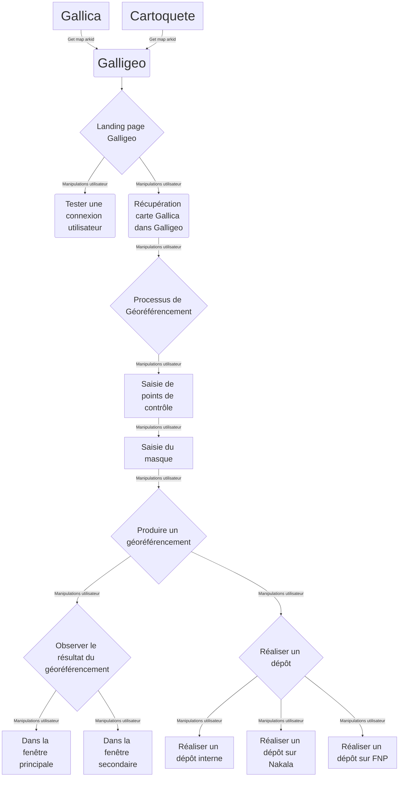

# galligeo

```mermaid
flowchart TD
    style A1 font-size:50px
    style A2 font-size:50px
    style B font-size:50px
    style C font-size:30px
    style D1 font-size:30px
    style D2 font-size:30px
    style E font-size:30px
    style F font-size:30px
    style G font-size:30px
    style H font-size:30px
    style I font-size:30px
    style H font-size:30px
    style I1 font-size:30px
    style I2 font-size:30px
    style J font-size:30px
    style K1 font-size:30px
    style K2 font-size:30px
    style K3 font-size:30px
    A1[Gallica] -->|Get map arkid| B(Galligeo)
    A2[Cartoquete] -->|Get map arkid| B(Galligeo)
    B --> C{Landing page Galligeo}
        C -->|Manipulations utilisateur| D1(Tester une connexion utilisateur)
        C -->|Manipulations utilisateur| D2(Récupération carte Gallica dans Galligeo)
        D2 -->|Manipulations utilisateur| E{Processus de Géoréférencement}
        E -->|Manipulations utilisateur| F[Saisie de points de contrôle]
        F -->|Manipulations utilisateur| G[Saisie du masque]
        G -->|Manipulations utilisateur| H{Produire un géoréférencement}
        H -->|Manipulations utilisateur| I{Observer le résultat du géoréférencement}
            I -->|Manipulations utilisateur| I1[Dans la fenêtre principale]
            I -->|Manipulations utilisateur| I2[Dans la fenêtre secondaire]
        H -->|Manipulations utilisateur| J{Réaliser un dépôt}
            J -->|Manipulations utilisateur| K1[Réaliser un dépôt interne]
            J -->|Manipulations utilisateur| K2[Réaliser un dépôt sur Nakala]
            J -->|Manipulations utilisateur| K3[Réaliser un dépôt sur FNP]
```
